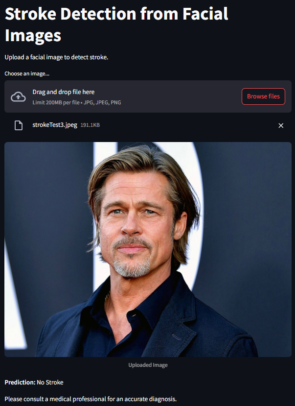

# Detecting Strokes from Facial Images using EfficientNet-B0

This project provides a web interface for detecting strokes from facial images using a deep learning model based on EfficientNet-B0. The model performs binary classification to determine whether a stroke is present or not from a given facial image.

## Installation

1. Clone this repository:
	```bash
	git clone https://github.com/kalpshah18/StrokeDetection
	cd StrokeDetection
	```
2. Install dependencies:
	```bash
	pip install -r requirements.txt
	```

## Usage

1. Make sure `efficientnet_b0_stroke_best.pth` is in the project directory. If not, run the entire jupyter notebook once.
2. Run the Streamlit app:
	```bash
	streamlit run streamlit.py
	```
3. Open the provided local URL in your browser.
4. Upload a facial image (JPG/PNG) to get a stroke prediction.

## Model Details

- **Architecture:** EfficientNet-B0 (torchvision)
- **Input Size:** 224x224 RGB images
- **Output:** Binary classification (Stroke / No Stroke)
- **Training Dataset:** [Face Images of Acute Stroke and Non Acute Stroke](https://www.kaggle.com/datasets/danish003/face-images-of-acute-stroke-and-non-acute-stroke) by Danish Jameel
- **Preprocessing:**
  - Resize to 224x224
  - Normalize with ImageNet mean and std

## Sample Outputs
Sample outputs from the Streamlit Interface

### Prediction 1:
 


### Prediction 2:


## File Structure

- `streamlit.py` — Streamlit web app for inference
- `efficientnet_b0_stroke_best.pth` — Trained model weights
- `StrokeDetection.ipynb` — Training and experimentation notebook
- `requirements.txt` — Python dependencies

## Acknowledgements

- Dataset: [Face Images of Acute Stroke and Non Acute Stroke](https://www.kaggle.com/datasets/danish003/face-images-of-acute-stroke-and-non-acute-stroke) by Danish Jameel
- Model: EfficientNet-B0 from torchvision

## Note
This project is just for education. Do not use it as **medical advice**.